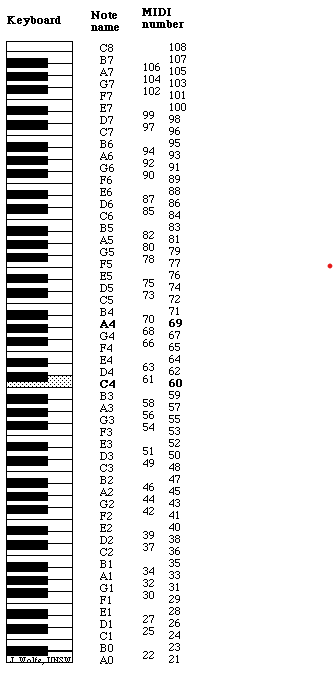

# oomp machine

## Overview

the **oomp machine** is a web-based synthesizer and sequencer that harnesses the mathematical beauty of Euclidean rhythms to generate dynamic and evolving rhythmic patterns.

## Concept

At its core, oomp machine uses the principle of Euclidean rhythms; distributing a given number of beats as evenly as possible across a sequence to create complex and organic patterns. These patterns, which are fundamental in various world music traditions, are reimagined through algorithmic processes in this digital instrument.

# Documentation (How to use and modify)

## Communicating with the device

You can set specific values to all the device parameters with the following function:

```
sendMessageToInport(device, "PARAMETER-NAME", VALUE);
```

### Master Controls (PARAMETERS)

- **Message Tag**: `"master-volume"` is used when sending volume changes.

### Drum Controls

Each drum (Kick, Snare, Hihat) has its own fieldset with two sections: a preset selector and a set of sliders.

#### Preset Selectors

- **Kick Preset**

  - **`kickPresetInput`**: A number input (range 0–3) for selecting a Kick preset.
  - **Message Tag**: `"kick-preset"`

- **Snare Preset**

  - **`snarePresetInput`**: A number input (range 0–3) for selecting a Snare preset.
  - **Message Tag**: `"snare-preset"`

- **Hihat Preset**
  - **`hihatPresetInput`**: A number input (range 0–3) for selecting a Hihat preset.
  - **Message Tag**: `"hihat-preset"`

#### Drum section

For each drum, there are four slider controls:

- **Gain**, **Steps**, **Pulses**, and **Rotate**
  - **Kick**:
    - **Message Tags**: `"kick-gain"`, `"kick-steps"`, `"kick-pulses"`, `"kick-rot"`
  - **Snare**:
    - **Message Tags**: `"snare-gain"`, `"snare-steps"`, `"snare-pulses"`, `"snare-rot"`
  - **Hihat**:
    - **Message Tags**: `"test-gain"`, `"hihat-steps"`, `"hihat-pulses"`, `"hihat-rot"`

#### Pattern Display

To get the drum patterns you can call the following function:

- **Function**: `drumPattern(instrument)`  
  instrument: kick, snare, hihat

  returns an array of numbers (e.g., `[1, 0, 1, 0]`).

  - 1 for play; 0 for pause

### Sequencer Controls

There are two sequencers in the app:

#### Cycle Sequencer (Sequencer 1)

- **Sliders**:

  - **Message Tags**: `"sequencer-gain"`, `"attack"`, `"decay"`, `"sustain"`, `"phaser-freq"`

- **Number Inputs (Pattern Grid)**:
  Always Bundles the 16 input values into one space-separated string and sends it with the tag `"sequencer-pattern"`.

  - Values: Standard MIDI

    - 0 for silence

    

  Look at example:

  ```
  function updateSequencer1Pattern() {
    // Select all inputs within the first sequencer's number grid that start with "num"
    const inputs = document.querySelectorAll(
        "fieldset.sequencer .number-grid input.number-input[id^='num']"
    );

    // Bundle all values into one space-separated string
    const valueString = Array.from(inputs)
        .map((input) => input.value)
        .join(" ");

    // Send the bundled string to the RNBO inport (update the tag as needed)
    sendMessageToInport(device, "sequencer-pattern", valueString);
  }

  ```

#### Sampler Sequencer

- **Sliders**:

  - **Message Tags**: `"sequencer2-gain"`, `"reverb-power"`, `"reverbMultiplier"`

- **Number Inputs (Pattern Grid)**:

  - **Function**:  
    Bundle the values into a space-separated string and send it with the tag `"sequencer2-pattern"`.

    - 1-3 for samples; 0 for silence

- Example:

```
function updateSequencer2Pattern() {
	// Select all inputs within the second sequencer's number grid that start with "seq2"
	const inputs = document.querySelectorAll(
		"fieldset.sequencer .number-grid input.number-input[id^='seq2']"
	);
	// Bundle all values into one space-separated string
	const valueString = Array.from(inputs)
		.map((input) => input.value)
		.join(" ");
	// Send the bundled string to the RNBO inport (update the tag as needed)
	sendMessageToInport(device, "sequencer2-pattern", valueString);
}
```
